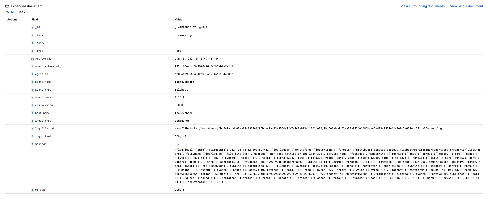

# Docker Logs in Elasticsearch from scratch.

Elastic Stack still doesn't seem to have a good alternative when it comes to working with structured logs. Trust me, I've spent a lot of time looking for one. It provides a self-hosted solution, has extensive tooling, and a wide range of integrations. 

> Well, there's one valid alternative: OpenSearch. But it is a fork, so I'm not sure if it counts. And it seems to have all the same problem Elastic have with a few on top.

And what could be the most fruitful source of logs if not docker? In this article, we will fire up an elastic stack and ship logs from docker there. So, get on board!


## Firing Elastic Stack up

If you wonder why did I say that I was looking for an alternative to elastic, that's because elastic has a few very annoying problems. First problem is that elasticsearch demands a lot of resources, especially RAM. So first, thing we need to do is to make sure we set docker memory limit to at least 3 GB.


Next problem is that it is ridiculously complicated to create a **simple** set up. First of all, by default it tries to setup a cluster, which is unneccessary for a local trial so we'll have to set `discovery.type=single-node`. Secondly, the newest version has additional overhead with some authentication token, which is so twisted I wasn't be able to deal with that even after numerous attempts. So I'll stick with the latest version that doesn't do it (7.17.3). So, here's the `docker-compose.yaml` we got:

> Too make it worse the small stack takes about 30 seconds to startup (become functional). So if you unable to reach kibana after starting up most likely you just need to wait.

```yaml
services:
  elasticsearch:
    image: elasticsearch:7.17.3
    environment:
      - discovery.type=single-node
  
  kibana:
    image: kibana:7.17.3
    environment:
      - ELASTICSEARCH_HOSTS=http://elasticsearch:9200
    ports:
      - 5601:5601
```

So now after running `docker compose up -d`, waiting for about half a minute, and opening [http://localhost:5601/](http://localhost:5601/) we should see Kibana welcome screen


## Shipping logs

By default docker containers write their logs in a JSON files, following this pattern `/var/lib/docker/containers/*/*.log`. That's perfect for us, since elastic provides a utility to ship logs from files, called `filebeat`. Here's the simplest configuration of the service `filebeat.yml`. The configuration reads container log files and ships them to elasticsearch index, we'll call `docker-logs`:

```yaml
filebeat.inputs:
- type: container
  paths:
    - '/var/lib/docker/containers/*/*.log'

output.elasticsearch:
  hosts: elasticsearch:9200
  indices:
    - index: "docker-logs"
```

To fire up the service, we'll need to give it access to the docker's log folder. That would imply mapping host docker folder to container docker folder in read-only mode: `/var/lib/docker:/var/lib/docker:ro` and granting the container root access: `user: root`. Plus, of course supply the configuration file from host machine to container via `./filebeat.yml:/usr/share/filebeat/filebeat.yml`. Here's the complete docker-compose service configuration:

```yaml
  shipper:
    image: docker.elastic.co/beats/filebeat:8.14.0
    user: root
    volumes:
      - /var/lib/docker:/var/lib/docker:ro
      - ./filebeat.yml:/usr/share/filebeat/filebeat.yml
```

Now, if we'll `docker compose up -d` again filebeat will start shipping logs to elastic. To see the logs in Kibana we will need to create an index pattern. For now let's grab all data we have using `*` as our index pattern by `Management > Stack Management > Kibana > Index Patterns > Create index pattern > name: *, Timestamp field: @timestampt > Create index pattern`. Now, opening `Analytics > Discover > *` will list all the logs we got from filebeat.


## Organizing our logs

Let's study the log we got:



First problem you may notice is that now we are unable to tell which container produced the log. Fortunally filebeat allows us to enchange exported logs using processors. In particular, we'll need a processor, called `add_docker_metadata` which reads the required metadata from docker socket file:

```yaml
processors:
- add_docker_metadata:
    host: "unix:///var/run/docker.sock"
```

And, of course, we'll also need to map our host socket file to the container socket file, like this: `/var/run/docker.sock:/var/run/docker.sock`. Now, after `docker compose up -d` we'll get a much more detailed logs looking like that:


## Processing JSON for structured logging

## Wrapping up

In this article, we've created a complete solution for exporting structured logs from docker to elastic stack. We've deployed Elasticsearch and Kibana using docker-compose. Then we deployed filebeat, shipping logs from docker log files to elastic. Finally, we've improved our shipping pipeline to utilize structured logging!

You can check out the final solution [here](). 
Thank you for reading! By the way... claps are appreciated 👉👈
