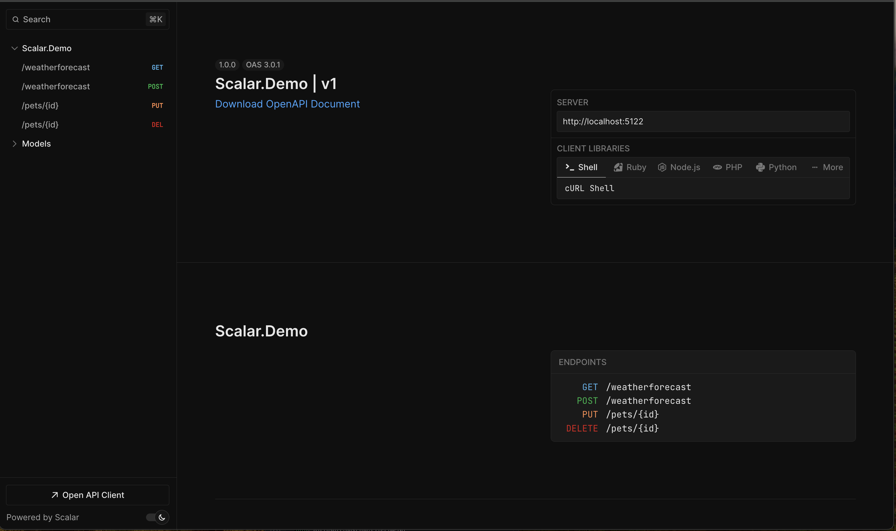
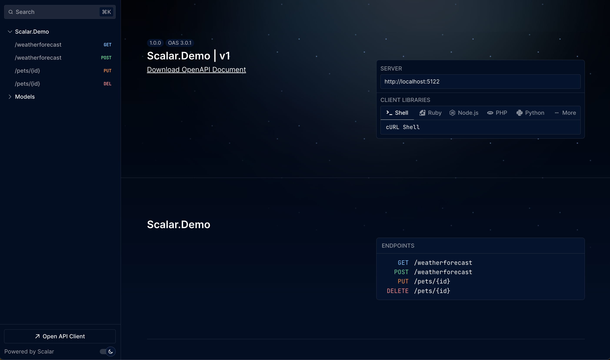
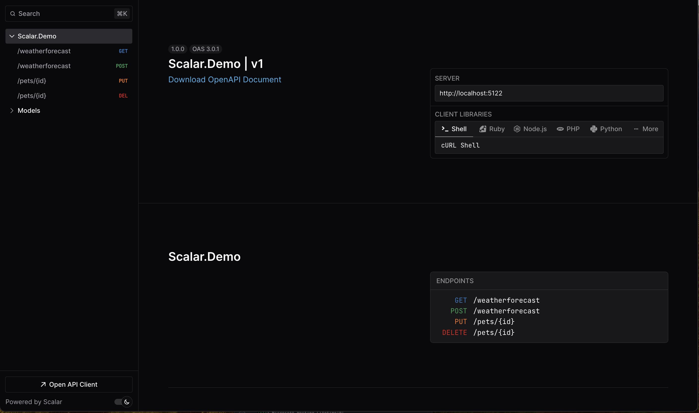

# Making Your OpenAPI (Swagger) Docs UI Awesome in .NET 9

Since .NET 9 we no longer get a Swagger UI included in the default `webapi` template. Although the document is still included, now via the `MapOpenApi` call, the UI is not here anymore. Gladly, it's relatively easy to get a documentation UI back. But the UI was boring anyway, so let's get something fancier!

## Meet Scalar

Let's imagine we already have our new .NET 9 API project created from the `dotnet new webapi` command. Now, to get the new look we'll use a library, called Scalar. We'll need to install their nuget package for that:

```sh
dotnet add package Scalar.AspNetCore
```

And since we already have `AddOpenApi` and `MapOpenApi` calls in the template all that's left to do is to map the UI page, which Scalar calls `ApiReference` like that:

```csharp
app.MapScalarApiReference();
```

So now if run our api and open a path `/scalar/v1` we should see our new UI! Scalar comes with 10 built-in themes, let's investigate them

## Theme 2: Default

By default we'll get theme #2 a.k.a the default theme, looking like this:



In my view, the theme looks cooler and more modern than the Swagger UI, but of course, staying with the default theme is very boring let's investigate what else we have

> You may also notice there are a few endpoints besides the default weather forecast, here's the code for the rest of the endpoints if you want to play around with them:

```csharp
app.MapPost("/weatherforecast", (WeatherForecast forecast) =>
{
    return forecast;
});

app.MapPut("/pets/{id}", (string id) =>
{
    return id;
});

app.MapDelete("/pets/{id}", (string id) =>
{
    return id;
});
```

### Theme 0: None

Funny enough, besides the default theme we have a `None` theme. For our experiments, we can servea  few themes on different routes. Here's how we can add the `None` theme to the `none/v1` route:

```csharp
app.MapScalarApiReference(o => 
    o.WithTheme(ScalarTheme.None)
    .WithEndpointPrefix("none/{documentName}")
);
```

And here's the look we'll get:


From the first look, it may look identical to the default theme. However, having them face-to-face I seem to notice that the `None` theme is slightly lighter. But, I guess, the difference is too insignificant, so let's carry on our search.

### Theme 1: Alternative


Well, the theme just lost a few colors here and there. That's definitely not something I'll define as fancy.

### Theme 3: Moon


To be honest, that's the theme I enjoy the least. Although the colors are not standard I wouldn't call them fancy either. For me, the colors give an unhealthy vibe. Let's just go to the next one!

### Theme 4: Purple


This one is much more pleasant than the moon, but still very boooring! To the next one!

### Theme 5: Solarized


Hm... about as unenjoyable as the moon theme. The theme seems to just make the text less readable with the addition of some unpleasant colors. Will we get something better after all?

### Theme 6: Blue Planet



Finally, something creative. I can easily imagine somebody picking the theme. Not to my taste though, I guess I just don't really like blue themes.

### Theme 7: Saturn



How is that different from the default one? you may ask. Well, seeing them all side by side I can assure you that this is the blackest theme, so if you are going for the maximum contrast, here's your choice!

### Theme 8: Kepler


Well, yet another blue theme, but much darker, which I personally prefer. But still not interesting enough.

### Theme 9: Mars


This is the most inspiring theme out of all. I guess that would be a perfect theme for the SpaceX documentation page. However, for a regular API, I'm afraid it will saturate quickly. I would like to find something more universal for my docs.

### Theme 10: Deep Space


The theme is also inspiring and fits my criteria for being fancy while staying rather professional. It also gives a nice minimalistic vibe, despite having a picture on the background.

## Additional Customizations

Scalar documentation says they also have a classic layout, but I could not find the option in their configuration API. (And I tried every option they have). What you can do is get rid of the sidebar and models section with the code like this:

```csharp
app.MapScalarApiReference(o => o
    .WithTheme(ScalarTheme.Mars)
    .WithModels(false)
    .WithSidebar(false)
    .WithEndpointPrefix("special/{documentName}")
);
```

However, it literally just removed the section and the sidebar, without changing any other part of the UI, so I didn't find any benefit of the removal. So I guess that's everything about Scalar for now. We'll see if they will bring more themes or more meaningful customization in the future!

## Wrapping Up!

It's very easy to get a nice looking .NET OpenAPI UI with .NET 9 - You just add `Scalar` and pick a theme. My theme of choice will be the `Deep Space` theme. The theme looks interesting, while still not being too extravagant, which makes it suitable for something you would use often.

So here's the line of code I'll add to all my new .NET projects:

```csharp
app.MapScalarApiReference(o => o.WithTheme(ScalarTheme.DeepSpace));
```

Hopefully, this article can serve as a reference for your own customizations. Leave your favorite theme in the comments, and ... claps are appreciated! 👏
