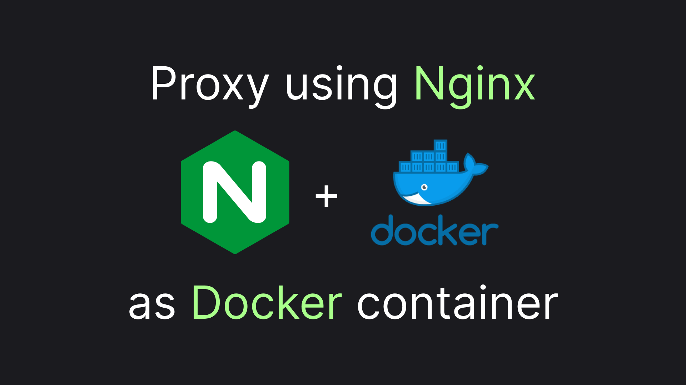

# Nginx and Docker: Getting Started

Nginx and Docker are probably two dominant components of backend infrastructure nowadays. Still, there's not much information on how to make them play together. This article attempts to fix it by providing a basis for a simple yet flexible and scalable setup of the nginx docker container. So, if you will, let's jump to the code!



## The Simplest Nginx Docker Setup

```yaml
name: playground

services:
  nginx:
    image: nginx
    ports:
      - 4500:80
```

```sh
docker compose up -d --build
```

When the build is finished if we open `http://localhost:4500/` in a browser we should see a page like this:


## Demystifying The Simplest Nginx Docker Setup

```sh
docker exec -it playground-nginx-1 cat etc/nginx/nginx.conf
```


```conf
user  nginx;
worker_processes  auto;

error_log  /var/log/nginx/error.log notice;
pid        /var/run/nginx.pid;


events {
    worker_connections  1024;
}


http {
    include       /etc/nginx/mime.types;
    default_type  application/octet-stream;

    log_format  main  '$remote_addr - $remote_user [$time_local] "$request" '
                      '$status $body_bytes_sent "$http_referer" '
                      '"$http_user_agent" "$http_x_forwarded_for"';

    access_log  /var/log/nginx/access.log  main;

    sendfile        on;
    #tcp_nopush     on;

    keepalive_timeout  65;

    #gzip  on;

    include /etc/nginx/conf.d/*.conf;
}
```

```conf
include /etc/nginx/conf.d/*.conf;
```

```sh
docker exec -it playground-nginx-1 cat /etc/nginx/conf.d/default.conf
```

```conf
server {
    listen       80;
    listen  [::]:80;
    server_name  localhost;

    #access_log  /var/log/nginx/host.access.log  main;

    location / {
        root   /usr/share/nginx/html;
        index  index.html index.htm;
    }

    #error_page  404              /404.html;

    # redirect server error pages to the static page /50x.html
    #
    error_page   500 502 503 504  /50x.html;
    location = /50x.html {
        root   /usr/share/nginx/html;
    }

    # proxy the PHP scripts to Apache listening on 127.0.0.1:80
    #
    #location ~ \.php$ {
    #    proxy_pass   http://127.0.0.1;
    #}

    # pass the PHP scripts to FastCGI server listening on 127.0.0.1:9000
    #
    #location ~ \.php$ {
    #    root           html;
    #    fastcgi_pass   127.0.0.1:9000;
    #    fastcgi_index  index.php;
    #    fastcgi_param  SCRIPT_FILENAME  /scripts$fastcgi_script_name;
    #    include        fastcgi_params;
    #}

    # deny access to .htaccess files, if Apache's document root
    # concurs with nginx's one
    #
    #location ~ /\.ht {
    #    deny  all;
    #}
}
```

```conf
root   /usr/share/nginx/html;
```

```sh
docker exec -it playground-nginx-1 cat /usr/share/nginx/html/index.html
```

```html
<!DOCTYPE html>
<html>
<head>
<title>Welcome to nginx!</title>
<style>
html { color-scheme: light dark; }
body { width: 35em; margin: 0 auto;
font-family: Tahoma, Verdana, Arial, sans-serif; }
</style>
</head>
<body>
<h1>Welcome to nginx!</h1>
<p>If you see this page, the nginx web server is successfully installed and
working. Further configuration is required.</p>

<p>For online documentation and support please refer to
<a href="http://nginx.org/">nginx.org</a>.<br/>
Commercial support is available at
<a href="http://nginx.com/">nginx.com</a>.</p>

<p><em>Thank you for using nginx.</em></p>
</body>
</html>
```

## Mocking Json API Endpoints

`nginx.conf`

```conf
server {
    location /about {
        default_type application/json;
        return 200 '{"description":"nginx proxy","version":"1.0"}';
    }

    error_page 404 @404_json;
    location @404_json {
      default_type application/json;
      return 404 '{"statusCode":"NotFound","reason":"NoNginxRoute"}';
    }
}
```

There are two ways to supply our configuration files to nginx - via volumes binding and via the `COPY` command during the build. 

`Dockerfile`:

```dockerfile
FROM nginx
COPY nginx.conf /etc/nginx/conf.d/default.conf
```

```yaml
name: playground

services:
  nginx:
    build: .
    ports:
      - 4500:80
```

`curl localhost:4500` or `curl localhost:4500/not-existing`

```json
{"statusCode":"NotFound","reason":"NoNginxRoute"}
```

`curl localhost:4500/about`

```json
{"description":"nginx proxy","version":"1.0"}
```

## Creating a Proxy

`one.conf`:

```conf
server {
    location /about {
        default_type application/json;
        return 200 '{"description":"service one","version":"1.0"}';
    }

    error_page 404 @404_json;
    location @404_json {
      default_type application/json;
      return 404 '{"statusCode":"NotFound","reason":"NoServiceOneRoute"}';
    }
}
```

`one.Dockerfile`

```dockerfile
FROM nginx
COPY one.conf /etc/nginx/conf.d/default.conf
```

```yaml
name: playground

services:
  one:
    build:
      context: .
      dockerfile: one.Dockerfile
```

`proxy.conf`

```conf
server {
    location /about {
        default_type application/json;
        return 200 '{"description":"proxy","version":"1.0"}';
    }

    location /one {
        rewrite ^/one(.*)$ $1 break;

        proxy_pass http://one;
    }

    error_page 404 @404_json;

    location @404_json {
      default_type application/json;
      return 404 '{"statusCode":"NotFound","reason":"NoProxyRoute"}';
    }
}
```

```conf
proxy_pass http://one;
```

```conf
rewrite ^/one(.*)$ $1 break;
```

`proxy.Dockerfile`

```dockerfile
FROM nginx
COPY proxy.conf /etc/nginx/conf.d/default.conf
```

With the addition of proxy service, we'll get our `compose.yml` looking like this:

```yaml
name: playground

services:
  one:
    build:
      context: .
      dockerfile: one.Dockerfile
  proxy:
    build:
      context: .
      dockerfile: proxy.Dockerfile
    ports:
      - 4500:80
```

```sh
curl localhost:4500/one/about
```

```json
{"description":"service one","version":"1.0"}
```

## Environment Variables, Templates, and More

`two.conf` `two.Dockerfile` which will be identical to `one.conf` and `one.Dockerfile`, except returning `service two` in the `about`. 

> I will skip the code in those files to avoid overloading the article. You can investigate the source code [here](https://github.com/astorDev/nist/tree/main/proxy/nginx/playground/v4).

```conf
server {
    location /about {
        default_type application/json;
        return 200 '{"description":"proxy","version":"1.0"}';
    }

    include /etc/nginx/conf.d/routes/default.conf;

    error_page 404 @404_json;

    location @404_json {
      default_type application/json;
      return 404 '{"statusCode":"NotFound","reason":"NoProxyRoute"}';
    }
}
```

> We create a `routes` subfolder so that our files don't match the pattern of the root config file: `include /etc/nginx/conf.d/*.conf;`

```conf
location /one {
    rewrite ^/one(.*)$ $1 break;
    proxy_pass $SERVICE_ONE_URL;
}

location /two {
    rewrite ^/two(.*)$ $1 break;
    proxy_pass $SERVICE_TWO_URL;
}
```

```Dockerfile
FROM nginx

COPY proxy.conf /etc/nginx/templates/default.conf.template
COPY proxy-routes.conf /etc/nginx/templates/routes/default.conf.template
```

Nginx will run environment variables substitution for the files in the `templates` folder, having the `.template` suffix, creating a file with substituted values inside matching the `conf.d` folder, trimming the `.template` suffix. In our case include from `/etc/nginx/templates/routes/default.conf.template` we'll get the following files with substituted variables `/etc/nginx/conf.d/routes/default.conf`.

```yml
services:
  proxy:
    build:
      context: .
      dockerfile: proxy.Dockerfile
    environment:
      - SERVICE_ONE_URL=http://one:80
      - SERVICE_TWO_URL=http://two:80
    ports:
      - 4500:80
  one:
    build:
      context: .
      dockerfile: one.Dockerfile
  two:
    build:
      context: .
      dockerfile: two.Dockerfile
```

```sh
curl localhost:4500/one/about
```

```json
{"description":"service one","version":"1.0"}
```

```sh
curl localhost:4500/two/about
```

```json
{"description":"service two","version":"1.0"}
```

## Wrapping this up!

The setup we've ended up with should be enough to serve as a foundation for any infrastructure you may want to build. There's also a [source code](https://github.com/astorDev/nist/tree/main/proxy/nginx/playground) for you to play around with. And by the way... claps are appreciated! 👏
