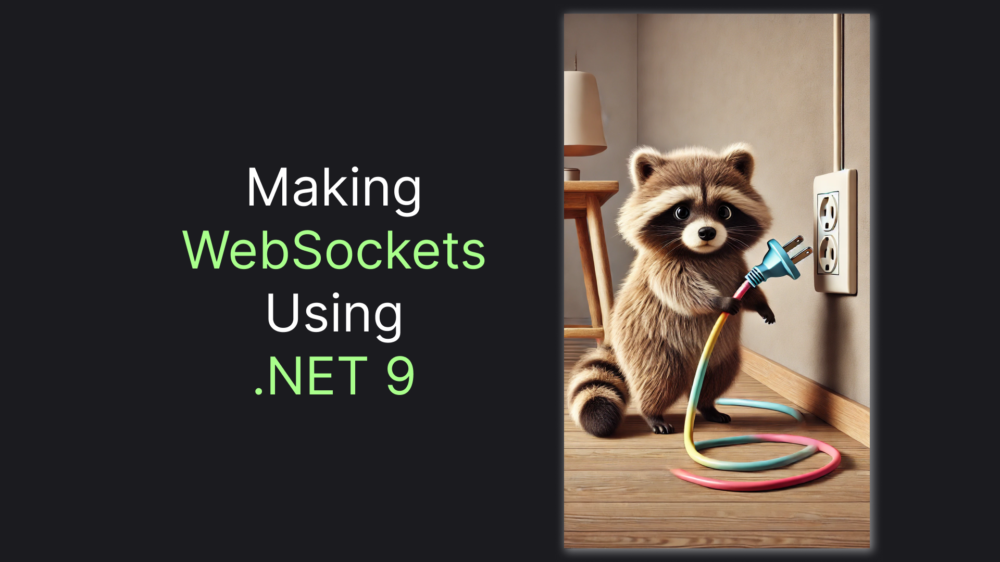
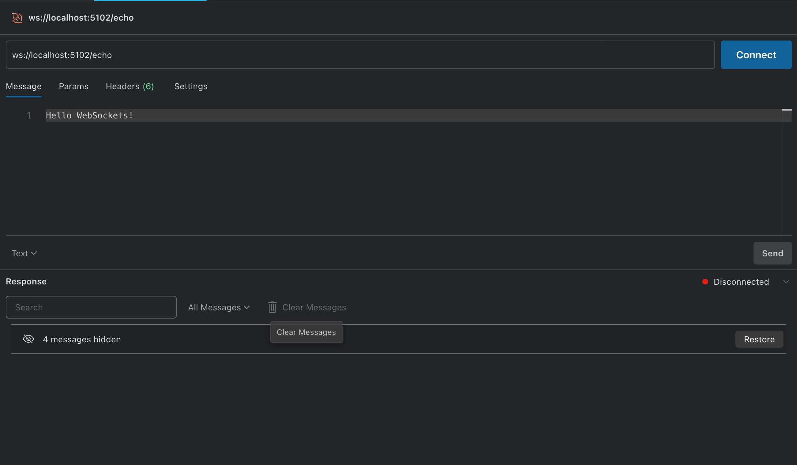
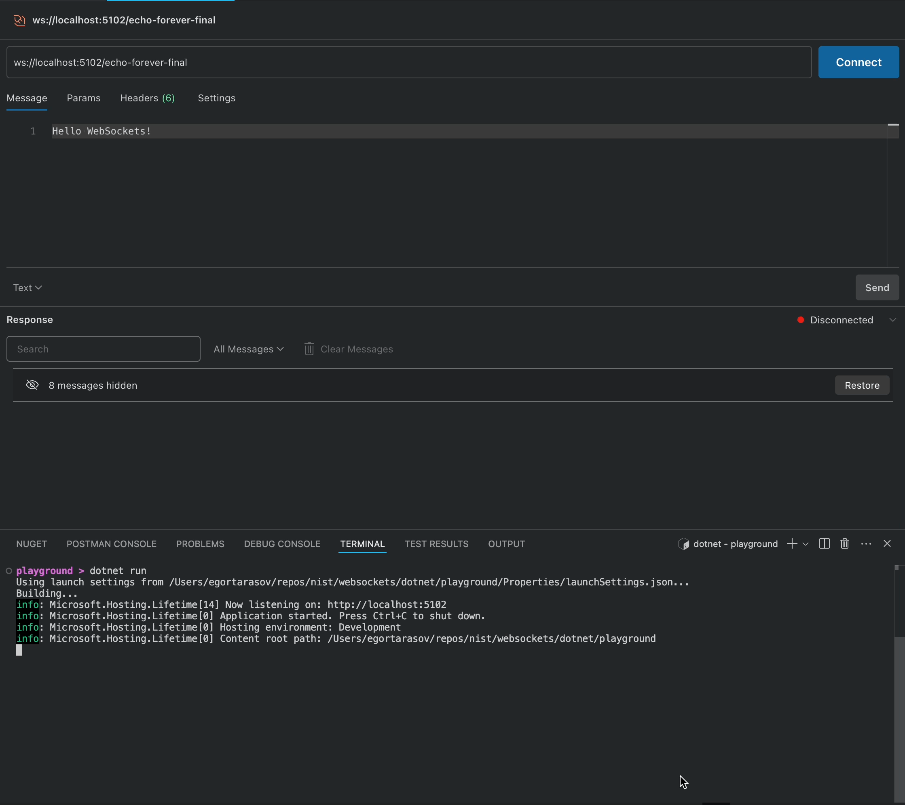

# WebSockets in .NET 9: A Getting Started Guide

> Learn how to implement WebSocket server endpoints using C# with ASP .NET Core 9 Minimal API.



WebSockets are the simplest way to provide real-time communication between front-end and back-end apps. And it's surely possible to use `ASP .NET Core` for that communication style. However, Microsoft's documentation for that technology seems poor and almost abandoned. In this article, I will try to fill the gap, giving you the jump start with WebSockets using the latest `.NET` stack.

> Or jump straight to the end for the [TLDR](#the-final-version)

## The Naive Approach: One-Time Echo

```sh
dotnet new web --name Playground.WebSockets
```

```csharp
app.UseWebSockets();

app.Map("/echo", async (HttpContext context) => {
    var webSocket = await context.WebSockets.AcceptWebSocketAsync();

    var buffer = new byte[8];

    await webSocket.ReceiveAsync(buffer, CancellationToken.None);

    await webSocket.SendAsync(
        buffer, 
        WebSocketMessageType.Text, 
        endOfMessage: true, 
        CancellationToken.None
    );
});
```


## Improving The Echo: Reading the Whole Message



```csharp
public static class WebSocketExtensions
{
    public static async Task<byte[]> ReceiveToTheEndAsync(this WebSocket webSocket, CancellationToken? cancellationToken = null)
    {
        var buffer = new byte[8];
        using var memoryStream = new MemoryStream();
        WebSocketReceiveResult result;

        do
        {
            result = await webSocket.ReceiveAsync(buffer, cancellationToken ?? CancellationToken.None);
            memoryStream.Write(buffer, 0, result.Count);
        } while (!result.EndOfMessage);

        return memoryStream.ToArray();
    }
}
```

```csharp
public static async Task SendFullTextAsync(this WebSocket webSocket, ArraySegment<byte> buffer, CancellationToken? cancellationToken = null)
{
    await webSocket.SendAsync(
        buffer,
        WebSocketMessageType.Text,
        endOfMessage: true,
        cancellationToken ?? CancellationToken.None
    );
}
```

```csharp
app.Map("/echo-long", async (HttpContext context) => {
    var webSocket = await context.WebSockets.AcceptWebSocketAsync();
    var buffer = await webSocket.ReceiveToTheEndAsync();
    await webSocket.SendFullTextAsync(buffer);
});
```


## Echoing Forever: Keeping the WebSocket

```csharp
app.Map("/echo-forever", async (HttpContext context, CancellationToken cancellationToken) => {
    var webSocket = await context.WebSockets.AcceptWebSocketAsync();

    while (!cancellationToken.IsCancellationRequested)
    {
        var buffer = await webSocket.ReceiveToTheEndAsync();
        await webSocket.SendFullTextAsync(buffer);    
    }
});
```


## The Almost Perfect Echo: Sending The Close Frame

```csharp
app.Map("/echo-forever-unexceptioned", async (HttpContext context, CancellationToken cancellationToken) => {
    var webSocket = await context.WebSockets.AcceptWebSocketAsync();

    while (!cancellationToken.IsCancellationRequested && webSocket.State == WebSocketState.Open)
    {
        var buffer = await webSocket.ReceiveToTheEndAsync(cancellationToken);
        app.Logger.LogInformation("Received: {buffer}", Encoding.UTF8.GetString(buffer));
        await webSocket.SendFullTextAsync(buffer, cancellationToken);
    }

    app.Logger.LogInformation("WebSocket closed");
});
```


```csharp
if (webSocket.State == WebSocketState.CloseReceived)
{
    await webSocket.CloseAsync(WebSocketCloseStatus.NormalClosure, "Closed", CancellationToken.None);
}
```


## The Final Version

There's a dedicated nuget package containing extension methods. Let's install it:

```sh
dotnet add package Nist.WebSockets
```

Here's how our echo endpoint will look after utilizing the package:

```csharp
using Nist;

// ...

app.Map("/echo-forever-final", async (HttpContext context, CancellationToken cancellationToken) => {
    var webSocket = await context.WebSockets.AcceptWebSocketAsync();

    while (!cancellationToken.IsCancellationRequested && webSocket.State == WebSocketState.Open)
    {
        var buffer = await webSocket.ReceiveAsync(cancellationToken: cancellationToken);
        app.Logger.LogInformation("Received: {buffer}", Encoding.UTF8.GetString(buffer));
        await webSocket.SendAsync(buffer, cancellationToken: cancellationToken);
    }

    if (webSocket.State == WebSocketState.CloseReceived)
    {
        await webSocket.CloseAsync(WebSocketCloseStatus.NormalClosure, "Closed", CancellationToken.None);
    }

    app.Logger.LogInformation("WebSocket closed");
});
```



The package is part of the [Nist](https://github.com/astorDev/nist) project, providing tools for **Ni**ce **S**tate **T**ransfer. In the repository, you can find the [article source code](https://github.com/astorDev/nist/tree/main/websockets/dotnet/playground) as well as the [package source code](https://github.com/astorDev/nist/tree/main/websockets/dotnet/lib). Give it a Star on the [Github](https://github.com/astorDev/nist)! And also ... claps for the article are appreciated 👉👈
